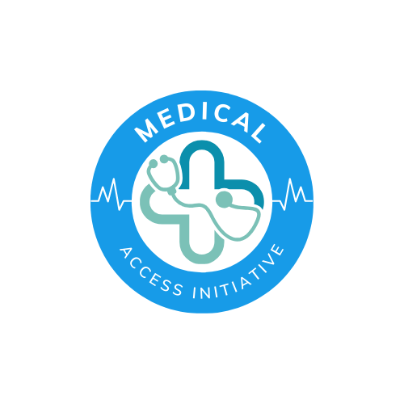

# MAI-hackathon-

## Medical Access Initiative

### Introduction
Medical Access Initiative is a comprehensive medical record management application designed to streamline the process of managing patient health records. It offers healthcare professionals and administrators a centralized platform to efficiently store, access, and update patient information securely.

### Features
- **Patient Management**: Easily add, search, and update patient records.
- **Medical History**: Keep track of patient medical history, diagnoses, treatments, and medications.
- **Appointment Scheduling**: Schedule and manage patient appointments and consultations.
- **Billing and Invoicing**: Generate bills and invoices for patient services.
- **Security**: Ensure data privacy and security with robust encryption and access control measures.
- **Integration**: Seamlessly integrate with existing hospital management systems and electronic health record (EHR) systems.
- **User-friendly Interface**: Intuitive and user-friendly interface for easy navigation and operation.

### Installation
To run the Medical Access Initiative application locally, follow these steps:
1. Clone the repository: `https://github.com/tranlynhathao/MAI-hackathon-.git`
2. Navigate to the project directory: `cd medical_access_initiative`
3. Install dependencies: `npm install`
4. Start the application: `npm start`

### Usage
1. Access the application through your web browser.
2. Log in with your credentials or sign up for a new account.
3. Navigate through the dashboard to manage patient records, appointments, billing, etc.
4. Use the search functionality to quickly find specific patient records or appointments.

### Technologies Used
- Frontend: HTML, CSS, JavaScript, React.js
- Backend: Node.js, Express.js
- Database: MongoDB
- Authentication: JSON Web Tokens (JWT)
- Other: Redux, Bootstrap, Axios

.
├── app demo
│   ├── backend
│   │   └── app.py
│   └── frontend
│       ├── public
│       │   ├── favicon.ico
│       │   ├── index.html
│       │   ├── logo192.png
│       │   ├── logo512.png
│       │   ├── manifest.json
│       │   └── robots.txt
│       ├── src
│       │   ├── App.css
│       │   ├── App.js
│       │   ├── App.test.js
│       │   ├── index.css
│       │   ├── index.js
│       │   ├── logo.svg
│       │   ├── reportWebVitals.js
│       │   └── setupTests.js
│       ├── README.md
│       ├── package-lock.json
│       └── package.json
├── data
├── mobile
│   └── app.dart
├── web
│   ├── index.html
│   ├── medicalRecords.js
│   ├── medicalRecords.ts
│   ├── styles.css
│   └── test.html
├── LICENSE
├── README.md
└── logo.png

### Contributors
- HAO, Tran Ly Nhat (haotran04022005@gmail.com)

### License
This project is licensed under the [MIT License](LICENSE).

### Contact Us
For inquiries or support, please contact us at hcsaifuture@gmail.com. We welcome your feedback and suggestions!

---
Copyright © 2024 Medical Access Initiative. All rights reserved.
